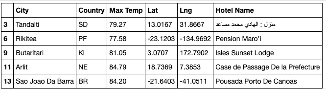
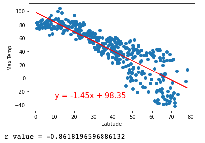

# World Weather Analysis
Analyze & visualize current weather data for over 500 cities across the world. Generate destinations and itineraries using Google Maps Platform APIs. 

## Purpose: 
A use-case for this project includes user-interface enhancement for travel apps through the provision of filterable hotel destinations based on user-selected weather preferences. 

Other use-cases could be educational in nature, with interactive heat maps displaying a variety of weather parameters, and scatter plots and linear regression analyses showing the relationship between weather parameters and latitude. 

## Tools: 
- Software: 
  - Python, Anaconda Navigator, Conda, Jupyter Notebook 
- Dependencies: 
  - pandas, numpy, matplotlib, citipy, requests, datetime, gmaps 
- API Data Sources: 
  -    [OpenWeatherMap](https://openweathermap.org/current) 
  -    [Google Maps and Places](https://developers.google.com/maps/documentation/places/web-service/search) 
  -    [Google Maps Directions](https://developers.google.com/maps/documentation/directions/overview)

## Method: 

- Create a Pandas DataFrame with 500 or more of the world's unique cities and their weather data in real time. [Link to code.](https://github.com/npvandyke/World_Weather_Analysis/blob/main/Weather_Database/Weather_Database.ipynb) 
  - Use the NumPy module to generate more than 1,500 random latitudes and longitudes.
  - Use the citipy module to list the nearest city to the latitudes and longitudes.
  - Use the OpenWeatherMap API to request the current weather data from each unique city in the list.
  - Parse the JSON data from the API request, collect the city weather data and add it to a DataFrame:

| City Data DataFrame | 
:-------------------------:|
  

- Create a Pandas DataFrame with hotel names for each city that meets the user's inputted weather criteria. [Link to code.](https://github.com/npvandyke/World_Weather_Analysis/blob/main/VacationPy.ipynb)
  -   Write two input statements that prompt the user to enter their minimum and maximum temperature criteria for their vacation.
  -   Filter the city_data_df DataFrame for the collected temperature criteria and create a new Pandas DataFrame.
  -   Use the Google Maps and Places API to request the nearest hotel for each city in the DataFrame. 
  -   Parse the JSON data from the API request, collect the hotel data and add it to the DataFrame: 
  
| Hotel Data DataFrame |
:-------------------------:

- Create a heatmap with pop-up markers that can display weather and hotel information for specific cities based on the user's travel preferences. [Link to code.](https://github.com/npvandyke/World_Weather_Analysis/blob/main/VacationPy.ipynb)

## Exploratory Analysis with Visualization

- Create scatter plots of the weather data for the following comparisons:

|                          |                           |
:-------------------------:|:-------------------------:
 | 
 | 

- Determine the correlations for the following weather data:
Latitude and temperature

|  Northen Hemisphere | Southern Hemisphere |
:-------------------------:|:-------------------------:
 | 
